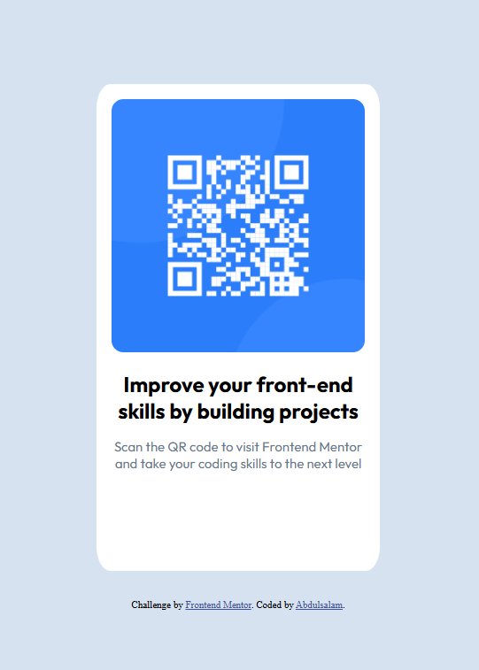

# Frontend Mentor - QR code component solution

This is a solution to the [QR code component challenge on Frontend Mentor](https://www.frontendmentor.io/challenges/qr-code-component-iux_sIO_H). Frontend Mentor challenges help you improve your coding skills by building realistic projects. 

## Table of contents

- [Overview](#overview)
  - [Screenshot](#screenshot)
  - [Links](#links)
- [My process](#my-process)
  - [Built with](#built-with)
  - [What I learned](#what-i-learned)
  - [Continued development](#continued-development)
  - [Useful resources](#useful-resources)
  - [AI Collaboration](#ai-collaboration)
- [Author](#author)
- [Acknowledgments](#acknowledgments)

**Note: Delete this note and update the table of contents based on what sections you keep.**

## Overview

### Screenshot




### Links

- Solution URL: [Add solution URL here](https://olammii.github.io/qr-code-component/)
- Live Site URL: [Add live site URL here](https://olammii.github.io/qr-code-component/)

## My process

### Built with

- Semantic HTML5 markup
- CSS custom properties
- Flexbox

### What I learned

Recap over some of my major learning while working through this project. 

```html
<header class="header">
        <h1 class="main-headings">START YOUR DAY</h1>
        <h1 class="primary-heading">WITH OUR COFFEE</h1>
        <button class="main-btn">Shop Now</button>
    </header>
    <main>
        <section id="our-story">
            <div class="img-container">
                <div class="img"></div>
            </div>
            <div class="section-content">
                <div class="title-style">
                    <span class="line"></span>
                    <h2 class="title">Our Story</h2>
```
```css
*{
    box-sizing: border-box;
    padding: 0;
    margin: 0;
}
```
## Author

- Website - [Add your name here](https://www.your-site.com)
- Frontend Mentor - [@yourusername](https://www.frontendmentor.io/profile/yourusername)
- Twitter - [@](https://www.twitter.com/yourusername)
